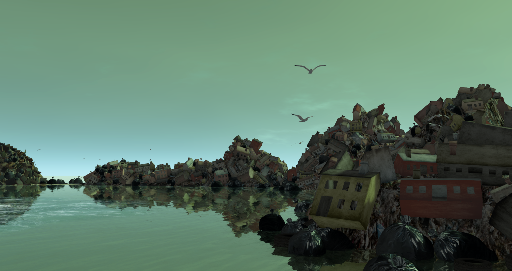
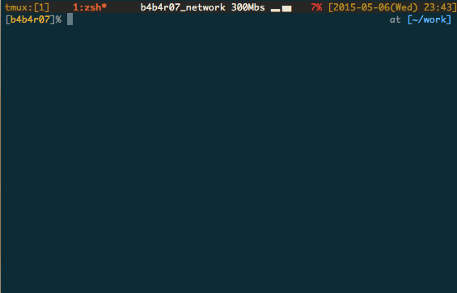

[](https://github.com/b4b4r07/gomi "./gomi -r")

`gomi` is a simple trash tool that works on CLI, written in Go

## Description

`rm` command threaten the CLI beginner. This is because it would delete the file without going through the trash. I was re-invented the `rm` as delete command with the concept of trash. It's `gomi`. Even if you delete the file by mistake, it can easily be restored.

***DEMO:***


*gomi* means the trash in Japanese.

## Features

- `rm` command with the trash
- Easy to restore (thanks to [`peco`](https://github.com/peco/peco)-like interface)
- QuickLook files in Restore mode
- A single binary
- Work with `trash` on OS and support [`Put Back`](http://www.mac-fusion.com/trash-tip-how-to-put-files-back-to-their-original-location/)
- Read YAML format configuration file

### QuickLook

`gomi` has the function that view file quickly (almost the same QuickLook of OS X). If the file under the cursor is directory, recursively it will list the files and subdirectories.

To QuickLook, type the *C-q* in Restore mode. The other key bindings is also enabled, by typing *C-n*, it is possible to view the next file in the state of QuickLook.


### Put Back

`gomi` supports [`Put Back`](http://www.mac-fusion.com/trash-tip-how-to-put-files-back-to-their-original-location/). It is possible to use the `trash` system that is a special file or device as a trash for `gomi`. Currently it has only supported Macintosh OS.



## Requirement

- Go
- On OS X [`osx-trash`](https://github.com/sindresorhus/osx-trash) is used (Optional; you don't need to install this)

## Usage

Basically usage is...

1. **Remove!** Throw away the trash :package:

		$ gomi files

2. **Restore!** Scavenge the trash :mag:

		$ gomi -r

It is able to replace `rm` with `gomi`. However, on the characteristics of it, it dosen't have options such as `-f` and `-i` at all. The available option is `-r`.

To actually delete rather than the trash:

	$ gomi ~/.gomi/2015/05/01/gomi_file.13_55_01

Run twice.

To specify the location where you want to restore:

	$ gomi -r .

In the above example, it's restored to the current directory.

### Keymap

| Key | Action |
|:---:|:---:|
| Enter | Restore under the cursor |
| Esc, C-c | Quit Restore mode or QuickLook |
| C-n, Down | Select Down |
| C-p, Up | Select Up |
| C-q | Toggle the QuickLook |

## Installation

If you want to go the Go way (install in GOPATH/bin) and just want the command:

	$ go get -u github.com/b4b4r07/gomi

To work with the trash of the system standard:

	$ cd $GOPATH/src/b4b4r07/gomi
	$ make install

### Binary only

Otherwise, download the binary from [GitHub Releases](https://github.com/b4b4r07/gomi/releases) and drop it in your `$PATH`.

- [OS X (386)](https://github.com/b4b4r07/gomi/releases/download/v0.1.2/gomi_darwin_386)
- [Linux (386)](https://github.com/b4b4r07/gomi/releases/download/v0.1.2/gomi_linux_386)
- [Windows (386)](https://github.com/b4b4r07/gomi/releases/download/v0.1.2/gomi_windows_386.exe)

## Setup

### Replace rm with gomi

Put something like this in your `~/.bashrc` or `~/.zshrc`:

```
alias rm="gomi"
```

This is recommended. By doing, it is possible to prevent that `rm` command would remove an important file.

### config.yaml

Then `gomi` read the configuration such as the following from the `~/.gomi/config.yaml`. In ignore_file, you can describe file that you do not want to add to history for restoration using regular expressions.

```yaml
ignore_files:
  - \.DS_Store
  - ~$
  - _test$
```

## Rivals

- [andreafrancia/trash-cli](https://github.com/andreafrancia/trash-cli)

	> Command line interface to the freedesktop.org trashcan.

- [sindresorhus/trash](https://github.com/sindresorhus/trash)

	> Cross-platform command-line app for moving files and directories to the trash - A safer alternative to `rm`

:do_not_litter: Do not use litter, use [gomi](https://github.com/b4b4r07/gomi).

## Author

BABAROT a.k.a. [@b4b4r07](https://twitter.com/b4b4r07)

## License

[MIT](https://raw.githubusercontent.com/b4b4r07/dotfiles/master/doc/LICENSE-MIT.txt)
